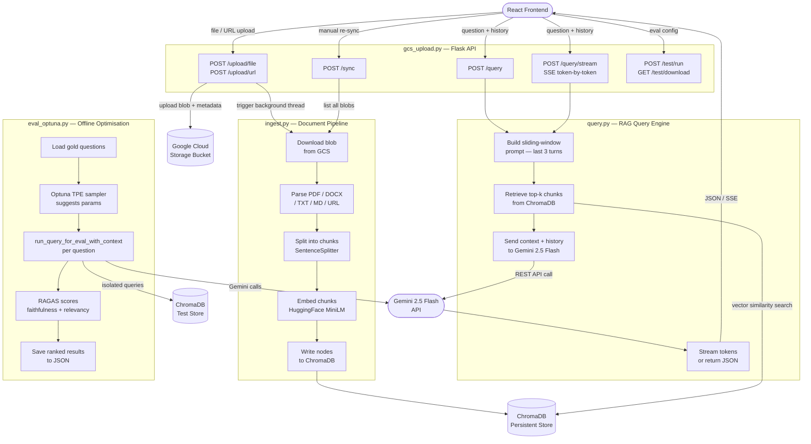

# Student Compass — Developer Guide

## Architecture Overview

The backend is three Python modules that work in sequence. A request from the frontend hits Flask, which delegates document storage to GCS, embedding/indexing to ChromaDB via the ingest layer, and answer generation to Gemini via the query layer. A separate command-line script (`eval_optuna.py`) performs offline hyperparameter optimisation using Optuna and RAGAS — it runs independently of Flask and writes results to a JSON file.



---

## Folder Structure

```
backend/
├── gcs_upload.py          # Flask app — all HTTP routes
├── ingest.py              # Document parsing, chunking, embedding, ChromaDB writes
├── query.py               # RAG query engine with sliding-window history and retry logic
├── eval_optuna.py         # Offline Optuna + RAGAS hyperparameter search (CLI only)
├── gold_questions.json    # Evaluation question/answer set (up to 50 questions)
├── optuna_results.json    # Written by eval_optuna.py after each study run
├── bucket_credentials.json  # GCS service account key (never commit to git)
├── .env                   # Environment variables (never commit to git)
├── chroma/                # ChromaDB persistent store — production (auto-created)
└── rag/
    └── chroma_test/       # Isolated ChromaDB used only during evaluation runs
```

---

## Installation

**Python 3.11 or higher is required.**

```bash
# 1. Create and activate a virtual environment
python -m venv venv
source venv/bin/activate          # Windows: venv\Scripts\activate

# 2. Install all dependencies
pip install flask flask-cors \
            google-cloud-storage \
            chromadb \
            llama-index \
            llama-index-vector-stores-chroma \
            llama-index-llms-google-genai \
            llama-index-embeddings-huggingface \
            llama-index-readers-web \
            sentence-transformers \
            python-dotenv \
            trafilatura \
            requests \
            tenacity \
            optuna \
            ragas \
            datasets \
            langchain-core \
            langchain-community \
            google-generativeai
```

> **Note on `eval_optuna.py` dependencies:** `optuna`, `ragas`, `datasets`, `langchain-core`, `langchain-community`, and `google-generativeai` are only required when running the offline evaluation script. They are not needed to run the Flask server.

---

## Environment Variables

Create a `.env` file in the `backend/` directory with the following keys:

```env
# ── Google Gemini ──────────────────────────────────────────────
GEMINI_API_KEY=your_gemini_api_key_here

# ── Google Cloud Storage ───────────────────────────────────────
GCS_BUCKET_NAME=your-gcs-bucket-name
GOOGLE_APPLICATION_CREDENTIALS=bucket_credentials.json

# ── ChromaDB paths ─────────────────────────────────────────────
CHROMA_PATH=chroma                      # production vector store
TEST_CHROMA_PATH=rag/chroma_test        # isolated store for evaluation runs
CHROMA_PATH_TEST=rag/chroma_test        # used by eval_optuna.py

# ── Evaluation ─────────────────────────────────────────────────
GOLD_QUESTIONS_PATH=gold_questions.json
```

---

## Credentials & Services

### Gemini API Key
- Obtained from [Google AI Studio](https://aistudio.google.com/app/apikey).
- Used by `ingest.py` (LLM metadata generation), `query.py` (answer generation), and `eval_optuna.py` (RAGAS scoring) via the `GoogleGenAI` LlamaIndex integration and `google.generativeai` directly.
- Model used: **`gemini-2.5-flash`** — set in `query.py`, `ingest.py`, and `eval_optuna.py`.

### Google Cloud Storage (GCS) Bucket
- The bucket stores all uploaded documents (PDFs, DOCX, TXT, MD files, and scraped web pages).
- `GCS_BUCKET_NAME` must match the name of a bucket you have already created in your GCP project.
- Files are stored under the `uploads/` prefix with UUID-prefixed blob names and metadata tags (`original_filename`, `doc_type`, `status`).

### GCS Service Account Key (`bucket_credentials.json`)
- A JSON service account key downloaded from the [GCP Console](https://console.cloud.google.com/iam-admin/serviceaccounts).
- The service account needs the **Storage Object Admin** role on your bucket.
- Point `GOOGLE_APPLICATION_CREDENTIALS` to this file — the Google Cloud SDK picks it up automatically.
- **Never commit this file to version control.** Add it to `.gitignore`.

---

## Running the Server

```bash
# From the backend/ directory with the virtual environment active:
python gcs_upload.py
```

The server starts on `http://localhost:5000` with threading enabled (required for SSE streaming).

---

## Component Reference

### `gcs_upload.py` — Flask API Layer

The HTTP entry point for all frontend requests. Responsibilities:

- **File & URL upload** (`/upload/file`, `/upload/url`) — validates, uploads to GCS, and spawns a background daemon thread to ingest the new document into ChromaDB without blocking the HTTP response.
- **Query routes** (`/query`, `/query/stream`) — receives `{ question, history }` from the frontend and delegates to `query.py`. The stream route returns a `text/event-stream` response so the UI can render tokens as they arrive.
- **Sync** (`/sync`) — triggers a full reconciliation between GCS and ChromaDB, adding any blobs not yet indexed and removing any that have been deleted.
- **Evaluation** (`/test/run`, `/test/download`) — runs the gold-question accuracy pipeline across RAG, keyword-search, and prompt-only modes using `ThreadPoolExecutor` for parallel question evaluation; streams progress as SSE and exports results as CSV.

---

### `ingest.py` — Document Pipeline

Transforms raw documents into searchable vector embeddings. Responsibilities:

- **Parsing** — uses LlamaIndex `SimpleDirectoryReader` for local files (PDF, DOCX, TXT, MD) and `TrafilaturaWebReader` for scraped URLs.
- **Chunking** — splits parsed text with `SentenceSplitter` using `BEST_CHUNK_SIZE = 800` tokens and 100-token overlap. This value was determined by the Optuna study (10 trials, 20 questions) and is defined as a named constant at the top of the file.
- **Embedding** — converts each chunk into a vector using a singleton **HuggingFace `BAAI/bge-small-en-v1.5`** model loaded once per process to avoid repeated disk reads.
- **Storage** — writes nodes and their metadata (`original_filename`, `doc_type`, `blob_name`, `summary`) into the ChromaDB persistent collection `studentcompass`.
- **Sync logic** — `sync_with_gcs()` diffs the GCS bucket against ChromaDB metadata and ingests or removes documents to keep both stores consistent.

#### Best-parameter constant in `ingest.py`

```python
# Best Optuna parameters
# Source: 10 trials, 20 questions
#   faithfulness=1.000  answer_relevancy=0.746  mean=0.873
BEST_CHUNK_SIZE = 800
```

Both `SentenceSplitter` calls in the file reference this constant so the production chunk size stays in sync with the optimised value.

---

### `query.py` — RAG Query Engine

Handles all question-answering logic. Responsibilities:

- **Best-parameter constants** — the four parameters chosen by the Optuna study are defined as named constants near the top of the file and applied globally:

```python
# Best Optuna parameters
# Source: 10 trials, 20 questions
#   faithfulness=1.000  answer_relevancy=0.746  mean=0.873
BEST_TOP_K       = 3
BEST_TEMPERATURE = 0.74
BEST_TOP_P       = 0.92
```

- **LLM setup** — `Settings.llm` is initialised once at import time using the best temperature and top_p values:

```python
Settings.llm = GoogleGenAI(
    model="gemini-2.5-flash",
    api_key=os.getenv("GEMINI_API_KEY"),
    temperature=BEST_TEMPERATURE,
    additional_kwargs={"top_p": BEST_TOP_P},
)
```

- **Sliding-window prompt builder** (`_build_qa_template`) — trims conversation history to the last **3 turns** (`HISTORY_WINDOW = 3`) before building the prompt, preventing the prompt from growing unbounded over long conversations.

- **Retrieval** — queries ChromaDB with the current question to fetch the top `BEST_TOP_K` (3) most semantically similar chunks, down from the previous hardcoded value of 5.

- **Streaming** (`run_query_stream`) — yields answer tokens as `data: {"type": "token", "value": "..."}` SSE events, followed by a `sources` event and a `done` event.

- **Evaluation helpers** (`run_query_for_eval`, `run_query_for_eval_with_context`, `run_keyword_search_for_eval`, `run_prompt_only_for_eval`) — isolated query functions used exclusively by the test pipeline; they operate against a separate `chroma_test` collection and never touch production data.

#### Retry Logic

`query.py` implements two complementary retry strategies to handle Gemini 503 / UNAVAILABLE errors gracefully.

**1. Tenacity decorator — non-streaming path**

Applied to `_call_query_engine` and `_call_llm_complete` via the `_RETRY_POLICY` dict:

```python
def _is_gemini_503(exc: BaseException) -> bool:
    msg = str(exc)
    return "503" in msg or "UNAVAILABLE" in msg

_RETRY_POLICY = dict(
    retry=retry_if_exception(_is_gemini_503),
    wait=wait_exponential(multiplier=1, min=2, max=30),  # 2s → 4s → 8s → 16s → 30s
    stop=stop_after_attempt(4),
    reraise=True,
)
```

If all four attempts fail, a `RetryError` is caught in `run_query()` and a user-friendly message is returned instead of crashing.

**2. Manual retry loop — streaming path**

Because a generator cannot be transparently retried by tenacity, `run_query_stream` uses a manual `_STREAM_DELAYS` loop:

```python
_STREAM_DELAYS = [2, 5, 15]   # seconds between retries (3 attempts total)

for attempt, delay in enumerate(_STREAM_DELAYS + [None]):
    try:
        streaming_response = query_engine.query(question)
        for token in streaming_response.response_gen:
            yield f"data: {json.dumps({'type': 'token', 'value': token})}\n\n"
        ...
        return   # success
    except Exception as exc:
        if _is_gemini_503(exc) and delay is not None:
            yield f"data: {json.dumps({'type': 'retrying', 'attempt': attempt + 1})}\n\n"
            time.sleep(delay)
        else:
            yield f"data: {json.dumps({'type': 'error', 'value': str(exc)})}\n\n"
            return
```

The frontend `Home.jsx` listens for `retrying` events and shows a message like *"Gemini is busy — retrying (attempt 1/3)…"* so the user knows a transient failure is being handled automatically.

---

### `eval_optuna.py` — Offline Hyperparameter Search

A standalone command-line script that finds the best combination of `chunk_size`, `top_k`, `temperature`, and `top_p` for the RAG pipeline using **Optuna** (Bayesian optimisation) scored by **RAGAS** (retrieval-augmented generation assessment). It runs entirely outside Flask and has no effect on the live server.

#### How it works

1. **Load gold questions** — reads up to N questions from `gold_questions.json`, each containing a `question` and a `gold_answer`.

2. **Optuna study** — creates a study with a **TPE (Tree-structured Parzen Estimator)** sampler (seeded for reproducibility). TPE is smarter than a grid search: it builds a probabilistic model of which parameter regions scored well and samples more heavily from them on subsequent trials.

3. **Per-trial objective** — for each trial Optuna proposes a parameter set. Every gold question is run through `run_query_for_eval_with_context()` against the isolated `rag/chroma_test` ChromaDB. This function returns both the generated answer and the list of retrieved chunk texts that RAGAS needs.

4. **RAGAS scoring** — results are assembled into a HuggingFace `Dataset` and evaluated on two metrics:
   - **`faithfulness`** — measures whether the answer is grounded in the retrieved context (1.0 = fully grounded, 0.0 = hallucinated).
   - **`answer_relevancy`** — measures whether the answer actually addresses the question asked.
   - The trial objective is `mean(faithfulness, answer_relevancy)`.

5. **Save results** — after all trials complete, a ranked results table is printed to stdout and all trial data is written to `optuna_results.json`.

#### RAGAS evaluator setup

RAGAS requires an LLM and an embeddings model for its own internal scoring. `eval_optuna.py` uses:

- A custom `_GeminiLLM` class that subclasses LangChain's `LLM` and wraps `google.generativeai` directly, avoiding version-conflict issues with `langchain_google_genai`.
- Local **HuggingFace `sentence-transformers/all-MiniLM-L6-v2`** embeddings for `answer_relevancy` — no extra API calls, no quota consumption.

#### Search space

| Parameter     | Type        | Range / Choices                    |
|---------------|-------------|------------------------------------|
| `chunk_size`  | categorical | 200, 300, 500, 800, 1000, 1200     |
| `top_k`       | int         | 1 – 5 (inclusive)                  |
| `temperature` | float       | 0.0 – 1.0                          |
| `top_p`       | float       | 0.7 – 1.0                          |

#### Throttling

A constant `INTER_CALL_DELAY = 0.6` seconds is applied between each Gemini call inside a trial. This keeps the script well under API quota and significantly reduces the number of 503 errors encountered during long studies.

#### CLI usage

```bash
# Default: 40 trials, all gold questions
python eval_optuna.py

# 10 trials, first 20 questions only — faster for iteration
python eval_optuna.py --n-trials 10 --questions 20

# Custom output file
python eval_optuna.py --out results_v2.json

# All options
python eval_optuna.py --n-trials 60 --questions 50 --out my_results.json --study-name rag_v2
```

| Flag            | Default                | Description                                     |
|-----------------|------------------------|-------------------------------------------------|
| `--n-trials`    | `40`                   | Number of Optuna trials to run                  |
| `--questions`   | `0` (all)              | Number of gold questions per trial (0 = all 50) |
| `--out`         | `optuna_results.json`  | Path to write JSON results                      |
| `--study-name`  | `rag_param_search`     | Optuna study name (used for display only)       |

#### Reading the output

When the study finishes, a ranked table is printed to the terminal:

```
================================================================
OPTUNA + RAGAS RESULTS — ranked by mean score
================================================================
Rank  Chunk  TopK   Temp   TopP   Faith  Relev   Mean
----------------------------------------------------------------
   1    800     3   0.74   0.92   1.000  0.746  0.873
   2    500     3   0.70   0.90   0.980  0.741  0.861
  ...
================================================================

✅ Best configuration:
   chunk_size=800  top_k=3  temperature=0.74  top_p=0.92
   faithfulness=1.000  answer_relevancy=0.746  mean=0.873
```

The same data is written to `optuna_results.json` with the structure:

```json
{
  "best_params": { "chunk_size": 800, "top_k": 3, "temperature": 0.74, "top_p": 0.92 },
  "best_value": 0.873,
  "trials": [
    {
      "number": 0,
      "params": { "chunk_size": 800, "top_k": 3, "temperature": 0.74, "top_p": 0.92 },
      "value": 0.873,
      "faithfulness": 1.0,
      "answer_relevancy": 0.746,
      "n_questions": 20
    },
    ...
  ]
}
```

#### Applying results to production

After identifying the best parameters, update the named constants in `query.py` and `ingest.py` manually:

```python
# query.py — update these three constants
BEST_TOP_K       = 3      # from best_params.top_k
BEST_TEMPERATURE = 0.74   # from best_params.temperature
BEST_TOP_P       = 0.92   # from best_params.top_p

# ingest.py — update this constant
BEST_CHUNK_SIZE  = 800    # from best_params.chunk_size
```

The comment block above each constant records the trial count, question count, and scores from the run that produced those values, providing an audit trail directly in the source.

> **Note on chunk size:** changing `BEST_CHUNK_SIZE` only affects documents ingested *after* the change. To apply a new chunk size to already-indexed documents, delete the ChromaDB store (`chroma/` directory) and re-run a full GCS sync from the Admin page so all documents are re-chunked and re-embedded at the new size.

---

# Frontend Setup Guide

## Frontend Architecture Overview

The frontend is a React 18 + Vite single-page application styled with Tailwind CSS. It is organized into three pages served by React Router, a shared component library, and a dedicated API service layer that handles all communication with the Flask backend.


---

## Folder Structure

```
frontend/
├── index.html                  # HTML shell — mounts div#root
├── package.json                # npm scripts and dependency declarations
├── vite.config.js              # Vite build config + dev proxy rules
├── tailwind.config.js          # Tailwind CSS configuration
├── postcss.config.js           # PostCSS pipeline (autoprefixer)
├── .env                        # Environment variables (never commit to git)
└── src/
    ├── main.jsx                # ReactDOM entry — renders <App /> into div#root
    ├── App.jsx                 # Root component — BrowserRouter + route definitions
    ├── styles/
    │   └── index.css           # Tailwind @base / @components / @utilities directives
    ├── pages/
    │   ├── Home.jsx            # / — student chat interface
    │   ├── Admin.jsx           # /admin — document upload and management
    │   └── Test.jsx            # /test — RAG evaluation runner
    ├── components/
    │   ├── NavBar.jsx          # Top navigation bar (shared across all pages)
    │   ├── QuestionBar.jsx     # Text input + Ask button
    │   ├── AnswerCard.jsx      # Streaming answer display with blinking cursor
    │   ├── SourcesCard.jsx     # Retrieved source list with doc-type badges
    │   ├── DisclaimerCard.jsx  # Static disclaimer notice
    │   ├── FileList.jsx        # Admin file table (download / delete / replace)
    │   ├── ProgressBar.jsx     # Upload progress indicator (0–100%)
    │   └── Notification.jsx    # Auto-dismissing toast (success / error / info)
    ├── api/
    │   ├── uploadService.js    # File/URL upload, file list, delete, GCS sync
    │   └── testService.js      # Evaluation stream + CSV download
    └── services/
        └── api.js              # Non-streaming askQuestion fallback
```

---

## Installation

**Node.js 18 or higher and npm are required.**

```bash
# 1. Navigate into the frontend directory
cd frontend

# 2. Install all dependencies
npm install

# 3. Start the development server
npm run dev
```

The app starts at `http://localhost:5173` by default. In development, Vite proxies all `/query`, `/upload`, `/files`, `/sync`, and `/health` requests to `http://localhost:5000` automatically — the Flask backend must be running separately.

### Build for production

```bash
npm run build      # Outputs optimised static files to dist/
npm run preview    # Serve the production build locally to verify
```

---

## Environment Variables

Create a `.env` file in the `frontend/` root directory:

```env
# URL of the Flask backend — only needed if the backend is NOT on localhost:5000
# Leave unset during local development; the Vite proxy handles routing automatically.
VITE_APP_API_URL=http://localhost:5000
```

In production (e.g. deployed to Cloud Run or a hosting provider), set `VITE_APP_API_URL` to the public URL of your backend service. Vite embeds this value at build time via `import.meta.env.VITE_APP_API_URL`.

---

## Running Both Services Together

The frontend and backend must be started in separate terminals:

```bash
# Terminal 1 — backend
cd backend
source venv/bin/activate
python gcs_upload.py          # starts Flask on :5000

# Terminal 2 — frontend
cd frontend
npm run dev                   # starts Vite dev server on :5173
```

Open `http://localhost:5173` in your browser to use the app.

---

## Component Reference

### `App.jsx` — Router Root

Wraps the entire application in a `BrowserRouter` and defines three client-side routes: `/` (Home), `/admin` (Admin), and `/test` (Test). Renders `NavBar` above the route outlet so navigation persists across all pages.

### `NavBar.jsx` — Navigation Bar

Persistent top bar with links to Chat, Admin, and Test. Uses `useLocation` from React Router to highlight the currently active route with a blue accent.

---

### Pages

#### `Home.jsx` — Student Chat Interface (`/`)

The primary user-facing page. Maintains a `history` array of completed `{ question, answer, sources }` turns and renders them as a scrollable chat thread — blue question bubbles on the right, answer cards on the left. On each new submission it slices history to the last 3 turns (`HISTORY_WINDOW = 3`) before sending to the backend, matching the server-side sliding window constant. Streams the live response token-by-token via SSE using `fetch` + `ReadableStream`.

The frontend handles `retrying` SSE events from the backend retry logic — when Gemini returns a 503, the UI shows a message like *"Gemini is busy — retrying (attempt 1/3)…"* and clears it automatically once tokens begin flowing again. A **New conversation** button in the sticky header clears all state and starts fresh.

Uses `QuestionBar`, `AnswerCard`, `SourcesCard`, and `DisclaimerCard`.


#### `Admin.jsx` — Document Management (`/admin`)

Admin-only page for managing the knowledge base. Supports file uploads (PDF, DOCX, TXT, MD) with real-time progress tracking via `XMLHttpRequest`, URL uploads that scrape and ingest web pages, a document-type selector (Admissions, Financial Aid, Graduation, etc.), a replace-existing toggle, and a manual GCS-to-ChromaDB sync trigger. Displays the full list of active documents via `FileList` and shows upload/error feedback via `Notification`.

#### `Test.jsx` — In-App RAG Evaluation Runner (`/test`)

Admin evaluation tool for benchmarking retrieval quality directly in the browser. This page runs evaluations against the backend's `/test/run` SSE endpoint and is separate from the offline Optuna script.

**Parameters** — the admin selects combinations of values for:
- **Chunk Sizes** — 200, 300, 500, 800, 1000, or 1200 tokens (multi-select)
- **Top-K** — 1, 2, 3, or 5 (multi-select)
- **Temperature** — 0.0, 0.2, 0.4, 0.7, or 1.0 (multi-select)
- **Top-P** — 0.7, 0.8, 0.9, 0.95, or 1.0 (multi-select)
- **Questions per run** — 10, 20, or 50
- **Evaluation modes** — RAG, Keyword search, Prompt-only (any combination)

The total number of evaluations is displayed as `configs × modes × questions` before the run starts.

**Scoring** — answers are scored against gold answers using cosine similarity on a 0–3 scale: 3 = Perfect, 2 = Good, 1 = Partial, 0 = Incorrect. This is the same scorer for all three modes, making results directly comparable.

**Results** — a live SSE progress log streams while the run is in progress. On completion, results are shown in a table grouped by parameter configuration and sorted by best score, with a **Comparison Summary** card showing the average score and average latency per mode across all configurations. A **Best RAG configuration** callout at the bottom of the table highlights the single highest-scoring config. Results can be exported as a CSV.

> **Relationship to `eval_optuna.py`:** the Test page uses a simpler cosine-similarity scorer and is designed for quick comparative runs in the browser. `eval_optuna.py` uses RAGAS metrics (faithfulness + answer_relevancy) and Bayesian optimisation, making it more thorough but slower and CLI-only. Use the Test page for rapid iteration; use `eval_optuna.py` for rigorous parameter selection before updating the production constants.

---

### Components

#### `QuestionBar.jsx`
Text input with an Ask button. Supports `Enter` key submission. Disables while a request is in flight (`loading` prop) and prevents empty submissions.

#### `AnswerCard.jsx`
Renders the answer text with `whitespace-pre-wrap` to preserve line breaks. Shows a pulsing blue cursor (`animate-pulse`) while the SSE stream is still delivering tokens (`isStreaming` prop).

#### `SourcesCard.jsx`
Displays the list of retrieved source documents returned by the backend. Each source shows the filename, a colour-coded document-type badge (e.g. "Financial Aid", "Registration"), and an optional truncated summary.

#### `DisclaimerCard.jsx`
Static card displayed below the chat interface noting that the tool provides informational guidance only and does not replace official advising.

#### `FileList.jsx`
Tabular list of all documents currently in GCS. Each row supports download (via signed GCS URL), delete, and in-place replacement. Uses a shared hidden `<input type="file">` element to avoid multiple DOM nodes.

#### `ProgressBar.jsx`
Thin animated horizontal bar driven by a `progress` prop (0–100). Used by `Admin.jsx` during file uploads to show XHR upload percentage in real time.

#### `Notification.jsx`
Auto-dismissing toast that disappears after 5 seconds. Accepts `success`, `error`, or `info` types and renders with appropriate colour styling and icon. Calls an `onClose` callback when dismissed.

---

### API / Service Layer

#### `src/api/uploadService.js`
All document management API calls: `uploadFile` (XHR with upload progress callback), `uploadFromUrl`, `fetchFiles`, `getDownloadUrl` (GCS signed URL), `deleteFile`, and `syncChroma`. All calls target `VITE_APP_API_URL` or fall back to `http://localhost:5000`.

#### `src/api/testService.js`
`streamEvaluation` opens an SSE stream to `/test/run`, calling `onProgress` and `onResult` callbacks as events arrive. Accepts an `AbortSignal` so the user can stop a run mid-flight via the ⛔ Stop button. `downloadResultsCSV` posts results to `/test/download` and triggers a browser file download dialog.

#### `src/services/api.js`
Simple non-streaming `askQuestion` function that posts to `/query` and returns a complete `{ answer, sources }` JSON response. Available as a fallback for any component that does not need token-by-token streaming.

## Future Improvements

- **Improve source selection logic**  
  Prevent the system from listing random or irrelevant sources when the model responds with *“I don’t have enough information to answer that question.”*

- **Add PowerPoint (.pptx) ingestion**  
  Extend the Admin upload pipeline to support `.pptx` files, including parsing, chunking, and embedding slide text.

- **Smarter and faster evaluation pipeline**  
  Enhance the Evaluation page’s evaluation logic with early‑elimination heuristics to skip low‑performing parameter combinations and reduce total runtime.

- **Admin authentication system**  
  Add an Admin login role with access to all three pages: **Chat**, **Admin**, and **Test**.

- **Student authentication system**  
  Add a Student login role with access to the **Chat** page only.

- **Guest mode (default)**  
  Unauthenticated users can access the Chat page and ask questions, but their chat history will not be saved.

- **Persistent chat history for students**  
  Logged‑in students will have their chat history stored and retrievable across sessions.

- **Dark mode UI theme**  
  Add a global dark/light mode toggle to improve accessibility and user comfort.

- **Multi-language support**  
  Allow the interface and chat responses to support multiple languages for broader accessibility.

- **Bulk file upload (multiple files at once)**  
  Allow admins to upload several documents in a single action, while still requiring all files in the batch to share the same document category.

  - **Advanced extension:** explore removing the category dropdown entirely by adding automatic document-type classification. The system could predict the correct category (e.g., Admissions, Financial Aid, Registration) based on the document’s text content during ingestion.
