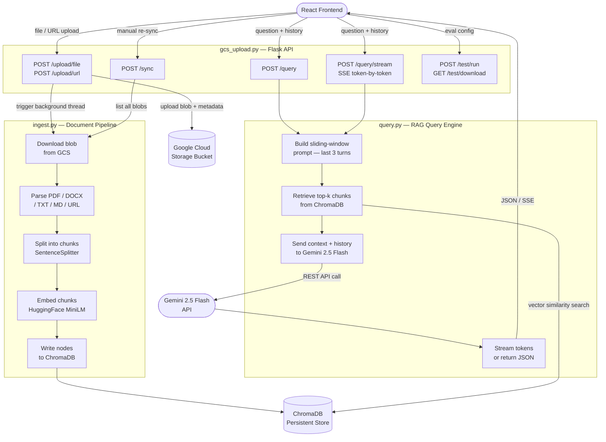
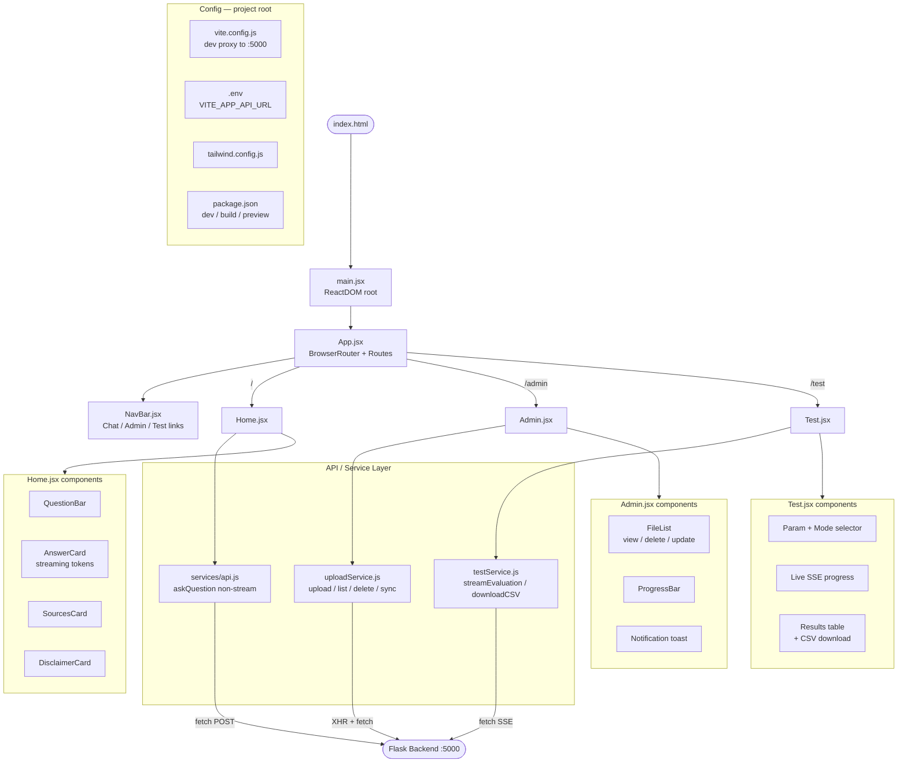

# Student Compass — Backend Setup Guide

## Architecture Overview

The backend is three Python modules that work in sequence. A request from the frontend hits Flask, which delegates document storage to GCS, embedding/indexing to ChromaDB via the ingest layer, and answer generation to Gemini via the query layer.



---

## Folder Structure

```
backend/
├── gcs_upload.py          # Flask app — all HTTP routes
├── ingest.py              # Document parsing, chunking, embedding, ChromaDB writes
├── query.py               # RAG query engine with sliding-window history
├── gold_questions.json    # Evaluation question set
├── bucket_credentials.json  # GCS service account key (never commit to git)
├── .env                   # Environment variables (never commit to git)
├── chroma/                # ChromaDB persistent store (auto-created)
└── rag/
    └── chroma_test/       # Isolated ChromaDB used only during evaluation runs
```

---

## Installation

**Python 3.11 or higher is required.**

```bash
# 1. Create and activate a virtual environment
python -m venv venv
source venv/bin/activate          # Windows: venv\Scripts\activate

# 2. Install all dependencies
pip install flask flask-cors \
            google-cloud-storage \
            chromadb \
            llama-index \
            llama-index-vector-stores-chroma \
            llama-index-llms-google-genai \
            llama-index-embeddings-huggingface \
            llama-index-readers-web \
            sentence-transformers \
            python-dotenv \
            trafilatura \
            requests
```

---

## Environment Variables

Create a `.env` file in the `backend/` directory with the following keys:

```env
# ── Google Gemini ──────────────────────────────────────────────
GEMINI_API_KEY=your_gemini_api_key_here

# ── Google Cloud Storage ───────────────────────────────────────
GCS_BUCKET_NAME=your-gcs-bucket-name
GOOGLE_APPLICATION_CREDENTIALS=bucket_credentials.json

# ── ChromaDB paths ─────────────────────────────────────────────
CHROMA_PATH=chroma                      # production vector store
TEST_CHROMA_PATH=rag/chroma_test        # isolated store for evaluation runs

# ── Evaluation ─────────────────────────────────────────────────
GOLD_QUESTIONS_PATH=gold_questions.json
```

---

## Credentials & Services

### Gemini API Key
- Obtained from [Google AI Studio](https://aistudio.google.com/app/apikey).
- Used by both `ingest.py` (LLM metadata generation) and `query.py` (answer generation) via the `GoogleGenAI` LlamaIndex integration.
- Model used: **`gemini-2.5-flash`** — set directly in `query.py` and `ingest.py`.

### Google Cloud Storage (GCS) Bucket
- The bucket stores all uploaded documents (PDFs, DOCX, TXT, MD files, and scraped web pages).
- `GCS_BUCKET_NAME` must match the name of a bucket you have already created in your GCP project.
- Files are stored under the `uploads/` prefix with UUID-prefixed blob names and metadata tags (`original_filename`, `doc_type`, `status`).

### GCS Service Account Key (`bucket_credentials.json`)
- A JSON service account key downloaded from the [GCP Console](https://console.cloud.google.com/iam-admin/serviceaccounts).
- The service account needs the **Storage Object Admin** role on your bucket.
- Point `GOOGLE_APPLICATION_CREDENTIALS` to this file — the Google Cloud SDK picks it up automatically.
- **Never commit this file to version control.** Add it to `.gitignore`.

---

## Running the Server

```bash
# From the backend/ directory with the virtual environment active:
python gcs_upload.py
```

The server starts on `http://localhost:5000` with threading enabled (required for SSE streaming).

---

## Component Reference

### `gcs_upload.py` — Flask API Layer

The HTTP entry point for all frontend requests. Responsibilities:

- **File & URL upload** (`/upload/file`, `/upload/url`) — validates, uploads to GCS, and spawns a background daemon thread to ingest the new document into ChromaDB without blocking the HTTP response.
- **Query routes** (`/query`, `/query/stream`) — receives `{ question, history }` from the frontend and delegates to `query.py`. The stream route returns a `text/event-stream` response so the UI can render tokens as they arrive.
- **Sync** (`/sync`) — triggers a full reconciliation between GCS and ChromaDB, adding any blobs not yet indexed and removing any that have been deleted.
- **Evaluation** (`/test/run`, `/test/download`) — runs the gold-question accuracy pipeline across RAG, keyword-search, and prompt-only modes; streams progress as SSE and exports results as CSV.

### `ingest.py` — Document Pipeline

Transforms raw documents into searchable vector embeddings. Responsibilities:

- **Parsing** — uses LlamaIndex `SimpleDirectoryReader` for local files (PDF, DOCX, TXT, MD) and `TrafilaturaWebReader` for scraped URLs.
- **Chunking** — splits parsed text with `SentenceSplitter` (default 512 tokens, 50-token overlap) to produce context-sized nodes.
- **Embedding** — converts each chunk into a vector using a singleton **HuggingFace `BAAI/bge-small-en-v1.5`** model loaded once per process to avoid repeated disk reads.
- **Storage** — writes nodes and their metadata (`original_filename`, `doc_type`, `blob_name`, `summary`) into the ChromaDB persistent collection `studentcompass`.
- **Sync logic** — `sync_with_gcs()` diffs the GCS bucket against ChromaDB metadata and ingests or removes documents to keep both stores consistent.

### `query.py` — RAG Query Engine

Handles all question-answering logic. Responsibilities:

- **Sliding-window prompt builder** (`_build_qa_template`) — trims conversation history to the last **3 turns** (`HISTORY_WINDOW = 3`) before building the prompt, preventing the prompt from growing unbounded over long conversations.
- **Retrieval** — queries ChromaDB with the current question to fetch the top-5 most semantically similar chunks (`similarity_top_k=5`).
- **Answer generation** — passes the retrieved context, the windowed history, and the current question to Gemini 2.5 Flash using a system prompt that constrains answers to the provided context only.
- **Streaming** (`run_query_stream`) — yields answer tokens as `data: {"type": "token", "value": "..."}` SSE events, followed by a `sources` event and a `done` event.
- **Evaluation helpers** (`run_query_for_eval`, `run_keyword_search_for_eval`, `run_prompt_only_for_eval`) — isolated query functions used exclusively by the test pipeline; they operate against a separate `chroma_test` collection and never touch production data.

---

# Frontend Setup Guide

## Frontend Architecture Overview

The frontend is a React 18 + Vite single-page application styled with Tailwind CSS. It is organized into three pages served by React Router, a shared component library, and a dedicated API service layer that handles all communication with the Flask backend.



---

## Folder Structure

```
frontend/
├── index.html                  # HTML shell — mounts div#root
├── package.json                # npm scripts and dependency declarations
├── vite.config.js              # Vite build config + dev proxy rules
├── tailwind.config.js          # Tailwind CSS configuration
├── postcss.config.js           # PostCSS pipeline (autoprefixer)
├── .env                        # Environment variables (never commit to git)
└── src/
    ├── main.jsx                # ReactDOM entry — renders <App /> into div#root
    ├── App.jsx                 # Root component — BrowserRouter + route definitions
    ├── styles/
    │   └── index.css           # Tailwind @base / @components / @utilities directives
    ├── pages/
    │   ├── Home.jsx            # / — student chat interface
    │   ├── Admin.jsx           # /admin — document upload and management
    │   └── Test.jsx            # /test — RAG evaluation runner
    ├── components/
    │   ├── NavBar.jsx          # Top navigation bar (shared across all pages)
    │   ├── QuestionBar.jsx     # Text input + Ask button
    │   ├── AnswerCard.jsx      # Streaming answer display with blinking cursor
    │   ├── SourcesCard.jsx     # Retrieved source list with doc-type badges
    │   ├── DisclaimerCard.jsx  # Static disclaimer notice
    │   ├── FileList.jsx        # Admin file table (download / delete / replace)
    │   ├── ProgressBar.jsx     # Upload progress indicator (0–100%)
    │   └── Notification.jsx    # Auto-dismissing toast (success / error / info)
    ├── api/
    │   ├── uploadService.js    # File/URL upload, file list, delete, GCS sync
    │   └── testService.js      # Evaluation stream + CSV download
    └── services/
        └── api.js              # Non-streaming askQuestion fallback
```

---

## Installation

**Node.js 18 or higher and npm are required.**

```bash
# 1. Navigate into the frontend directory
cd frontend

# 2. Install all dependencies
npm install

# 3. Start the development server
npm run dev
```

The app starts at `http://localhost:5173` by default. In development, Vite proxies all `/query`, `/upload`, `/files`, `/sync`, and `/health` requests to `http://localhost:5000` automatically — the Flask backend must be running separately.

### Build for production

```bash
npm run build      # Outputs optimised static files to dist/
npm run preview    # Serve the production build locally to verify
```

---

## Environment Variables

Create a `.env` file in the `frontend/` root directory:

```env
# URL of the Flask backend — only needed if the backend is NOT on localhost:5000
# Leave unset during local development; the Vite proxy handles routing automatically.
VITE_APP_API_URL=http://localhost:5000
```

In production (e.g. deployed to Cloud Run or a hosting provider), set `VITE_APP_API_URL` to the public URL of your backend service. Vite embeds this value at build time via `import.meta.env.VITE_APP_API_URL`.

---

## Running Both Services Together

The frontend and backend must be started in separate terminals:

```bash
# Terminal 1 — backend
cd backend
source venv/bin/activate
python gcs_upload.py          # starts Flask on :5000

# Terminal 2 — frontend
cd frontend
npm run dev                   # starts Vite dev server on :5173
```

Open `http://localhost:5173` in your browser to use the app.

---

## Component Reference

### `App.jsx` — Router Root

Wraps the entire application in a `BrowserRouter` and defines three client-side routes: `/` (Home), `/admin` (Admin), and `/test` (Test). Renders `NavBar` above the route outlet so navigation persists across all pages.

### `NavBar.jsx` — Navigation Bar

Persistent top bar with links to Chat, Admin, and Test. Uses `useLocation` from React Router to highlight the currently active route with a blue accent.

---

### Pages

#### `Home.jsx` — Student Chat Interface (`/`)

The primary user-facing page. Maintains a `history` array of completed `{ question, answer, sources }` turns and renders them as a scrollable chat thread — blue question bubbles on the right, answer cards on the left. On each new submission it slices history to the last 3 turns (`HISTORY_WINDOW = 3`) before sending to the backend, matching the server-side sliding window constant. Streams the live response token-by-token via SSE using `fetch` + `ReadableStream`. A **New conversation** button in the sticky header clears all state and starts fresh. Uses `QuestionBar`, `AnswerCard`, `SourcesCard`, and `DisclaimerCard`.

#### `Admin.jsx` — Document Management (`/admin`)

Admin-only page for managing the knowledge base. Supports file uploads (PDF, DOCX, TXT, MD) with real-time progress tracking via `XMLHttpRequest`, URL uploads that scrape and ingest web pages, a document-type selector (Admissions, Financial Aid, Graduation, etc.), a replace-existing toggle, and a manual GCS-to-ChromaDB sync trigger. Displays the full list of active documents via `FileList` and shows upload/error feedback via `Notification`.

#### `Test.jsx` — RAG Evaluation Runner (`/test`)

Admin evaluation tool for benchmarking retrieval quality. Lets the admin select combinations of chunk size, top-k, temperature, and top-p parameters, choose which evaluation modes to run (RAG, keyword-only, prompt-only), and stream live progress from the backend SSE endpoint. Displays results in a scored table grouped by mode and exports them as a CSV via `testService.js`.

---

### Components

#### `QuestionBar.jsx`
Text input with an Ask button. Supports `Enter` key submission. Disables while a request is in flight (`loading` prop) and prevents empty submissions.

#### `AnswerCard.jsx`
Renders the answer text with `whitespace-pre-wrap` to preserve line breaks. Shows a pulsing blue cursor (`animate-pulse`) while the SSE stream is still delivering tokens (`isStreaming` prop).

#### `SourcesCard.jsx`
Displays the list of retrieved source documents returned by the backend. Each source shows the filename, a colour-coded document-type badge (e.g. "Financial Aid", "Registration"), and an optional truncated summary.

#### `DisclaimerCard.jsx`
Static card displayed below the chat interface noting that the tool provides informational guidance only and does not replace official advising.

#### `FileList.jsx`
Tabular list of all documents currently in GCS. Each row supports download (via signed GCS URL), delete, and in-place replacement. Uses a shared hidden `<input type="file">` element to avoid multiple DOM nodes.

#### `ProgressBar.jsx`
Thin animated horizontal bar driven by a `progress` prop (0–100). Used by `Admin.jsx` during file uploads to show XHR upload percentage in real time.

#### `Notification.jsx`
Auto-dismissing toast that disappears after 5 seconds. Accepts `success`, `error`, or `info` types and renders with appropriate colour styling and icon. Calls an `onClose` callback when dismissed.

---

### API / Service Layer

#### `src/api/uploadService.js`
All document management API calls: `uploadFile` (XHR with upload progress callback), `uploadFromUrl`, `fetchFiles`, `getDownloadUrl` (GCS signed URL), `deleteFile`, and `syncChroma`. All calls target `VITE_APP_API_URL` or fall back to `http://localhost:5000`.

#### `src/api/testService.js`
`streamEvaluation` opens an SSE stream to `/test/run`, calling `onProgress` and `onResult` callbacks as events arrive. `downloadResultsCSV` posts results to `/test/download` and triggers a browser file download dialog.

#### `src/services/api.js`
Simple non-streaming `askQuestion` function that posts to `/query` and returns a complete `{ answer, sources }` JSON response. Available as a fallback for any component that does not need token-by-token streaming.
